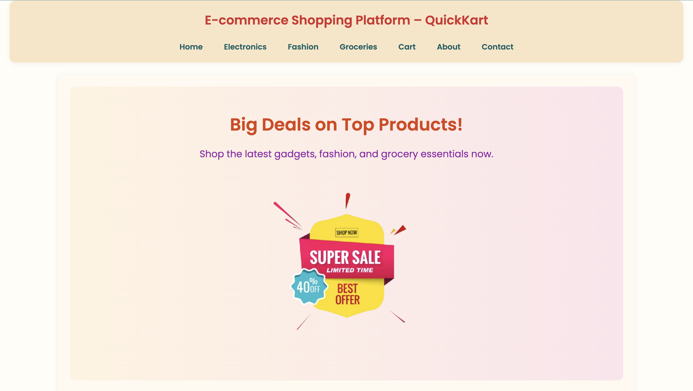
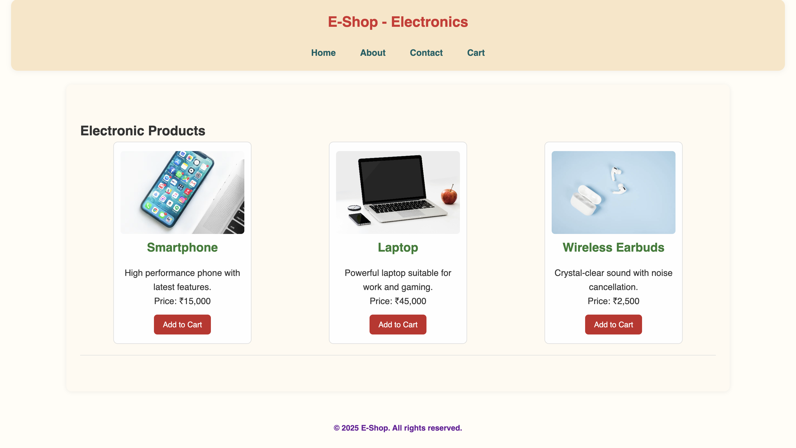
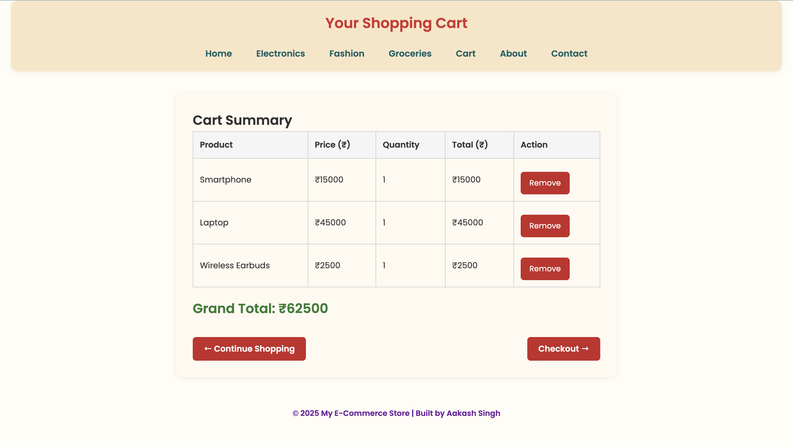

# 🛒 E-commerce Website – QuickKart

QuickKart is a responsive e-commerce website designed for seamless online shopping. It offers a clean UI, product pages, cart management, and a smooth user experience.

---

## 📁 Project Structure

```text
index.html                # Homepage  
about.html                # About page  
contact.html              # Contact page  
cart.html                 # Shopping cart page  
checkout.html             # Checkout page  
products/                 # Product category pages  
css/style.css             # Main stylesheet  
js/script.js              # JavaScript file  
screenshot-home.png       # Screenshot - Homepage  
screenshot-cart.png       # Screenshot - Cart page  
screenshot-product.png    # Screenshot - Product page  
README.md                 # Project documentation

```


---

## 💡 Features

- Product categories: **Electronics**, **Fashion**, **Groceries**  
- Add to Cart button  
- Simple newsletter subscription form  
- Customer testimonials section  
- Responsive layout with clean navigation  

---

## 🔧 Tools Used

- **HTML5**  
- **CSS3**  
- **JavaScript**  
- **Google Fonts**

---

## 📸 Screenshots

### 🏠 Homepage  


### 🛍️ Product Page  


### 🛒 Cart Page  


---

## 🔗 Live Demo

[View GitHub Repository](https://github.com/AakashSingh07/E-commerce)

---

## 📌 Author

Made with by [Aakash Singh](https://github.com/AakashSingh07)
